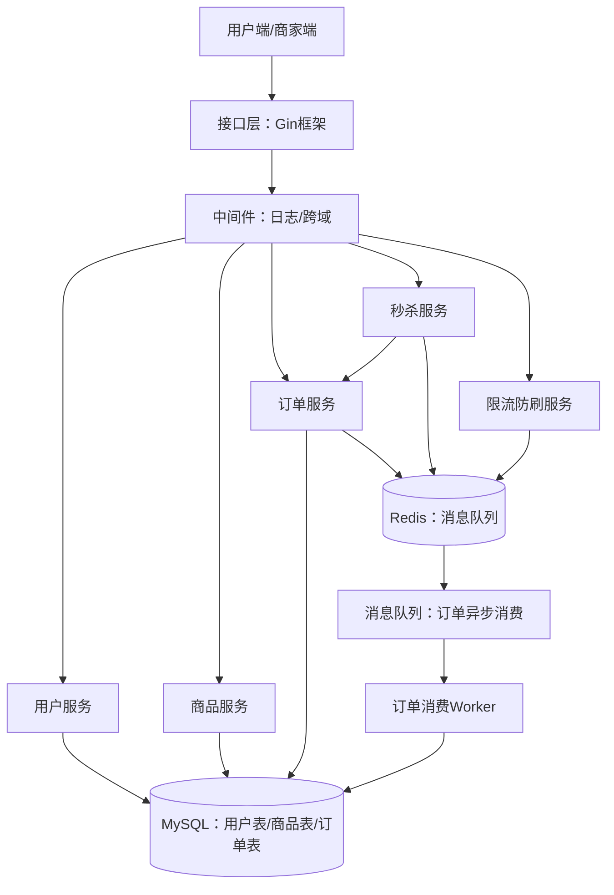

# Gin电商秒杀API服务系统设计文档
## 一、文档概述
### 1.1 文档目的
本文档详细阐述Gin电商秒杀API服务的系统架构、模块设计、技术实现方案及数据交互规则，为开发团队提供技术开发依据，为测试与运维团队提供系统认知与操作指南，确保系统开发符合业务需求与技术标准。

### 1.2 文档范围
覆盖系统整体架构、核心模块设计（用户、商品、秒杀、订单）、数据存储设计、接口设计、部署设计等内容，不包含具体代码实现细节与第三方组件内部原理。

### 1.3 术语定义
| 术语 | 定义 |
|------|------|
| 原子操作 | 不可中断的操作，如Redis的DECR命令，确保并发场景下数据一致性 |
| 削峰填谷 | 通过消息队列缓存瞬时高并发请求，异步消费处理，缓解后端压力 |
| QPS | 每秒查询率，衡量系统并发处理能力的核心指标 |
| 软删除 | 通过标记字段（如deleted_at）标识数据删除状态，而非物理删除数据 |

## 二、系统整体架构
### 2.1 架构分层
系统采用分层架构设计，自下而上分为数据层、服务层、接口层，各层职责清晰，低耦合高内聚：
1. **数据层**：负责数据存储与管理，包含MySQL（持久化存储用户、商品、订单数据）、Redis（缓存库存、限流计数、消息队列）；
2. **服务层**：封装核心业务逻辑，包含用户服务、商品服务、秒杀服务、订单服务，提供模块化业务能力；
3. **接口层**：基于Gin框架提供接口，处理HTTP请求与响应，集成中间件。

### 2.2 架构图




### 2.3 核心业务流程
秒杀核心业务流程为：
1. 商家通过商品服务创建秒杀活动，系统将商品库存同步至Redis；
2. 用户通过接口层发起秒杀请求；
3. 秒杀服务调用Redis原子命令扣减库存，扣减成功则生成订单信息并发送至Redis消息队列；
4. 订单消费Worker从消息队列获取订单信息，异步写入MySQL；
5. 用户通过订单服务查询秒杀结果与订单状态。

## 三、核心模块设计
### 3.1 用户模块
#### 3.1.1 功能职责
负责用户注册、登录、信息查询，保障用户身份合法性，为秒杀活动提供用户身份基础。

#### 3.1.2 数据设计
基于MySQL用户表存储用户数据，表结构如下：
type User struct {
   ID  uint   `gorm:"primaryKey" json:"id"`                         // 主键ID
   Username string `gorm:"size:50;uniqueIndex;not null" json:"username"` // 用户名(唯一)
   Password string `gorm:"size:100;not null" json:"-"`                 // 密码(密文，返回JSON时隐藏)
   Phone string `gorm:"size:20;uniqueIndex" json:"phone"`             // 手机号(唯一)
   CreatedAt time.Time `json:"created_at"`                          // 创建时间
   DeletedAt gorm.DeletedAt `gorm:"index" json:"-"`                  // 软删除标记
}         

#### 3.1.3 核心逻辑
1. **注册**：校验用户名/手机号唯一性，密码加密后写入MySQL；
2. **登录**：校验用户名与密码正确性，返回登录成功标识；
3. **信息查询**：根据用户ID查询用户基础信息（屏蔽密码字段）。

### 3.2 商品与秒杀活动模块
#### 3.2.1 功能职责
管理商品信息与秒杀活动配置，提供商品查询、秒杀活动创建/启停能力，为秒杀流程提供商品与活动基础数据。

#### 3.2.2 数据设计
1. **商品表**（MySQL）：存储商品基础信息，包含ID、Name、Price、Stock、Version、DeletedAt；
2. **秒杀活动表**（MySQL）：存储秒杀活动配置，包含ID、ProductID（关联商品）、StartTime、EndTime、DeletedAt；

#### 3.2.3 核心逻辑
1. **商品管理**：支持商品增删改查；
2. **秒杀活动管理**：管理员创建秒杀活动时，系统自动将商品库存从MySQL同步至Redis（`SET seckill:stock:{product_id} {stock}`）；
3. **商品查询**：优先从Redis缓存查询商品与秒杀活动信息，缓存未命中则从MySQL查询并同步至Redis。

### 3.3 秒杀模块
#### 3.3.1 功能职责
处理秒杀请求，核心解决库存扣减原子性与高并发响应问题，杜绝超卖/少卖。

#### 3.3.2 技术方案
1. **库存扣减**：采用Redis `DECR`原子命令或Lua脚本实现“查库存-扣库存-记用户抢购记录”一体化操作，Lua脚本如下：
```lua
-- 校验库存与用户是否已抢购
local stockKey = "seckill:stock:" .. KEYS[1]
local userKey = "seckill:user:" .. KEYS[1] .. ":" .. ARGV[1]
local stock = redis.call("GET", stockKey)

if not stock or tonumber(stock) <= 0 then
    return 0 -- 库存不足
end

if redis.call("EXISTS", userKey) == 1 then
    return 2 -- 已抢购
end

-- 扣减库存并记录用户
redis.call("DECR", stockKey)
redis.call("SET", userKey, 1, "EX", 86400) -- 记录1天
return 1 -- 扣减成功
```
2. **结果返回**：库存扣减成功后立即返回“秒杀成功”，不等待订单写入MySQL，提升响应速度；
3. **库存同步**：将Redis库存同步至MySQL商品表，确保数据最终一致性。

### 3.4 订单模块
#### 3.4.1 功能职责
负责订单生成、异步写入、状态查询，实现订单数据持久化与异步处理，缓解高并发下MySQL压力。

#### 3.4.2 数据设计
1. **订单表**（MySQL）：存储订单信息，包含ID、UserID、ProductID、OrderAmount、Status、CreatedAt、DeletedAt。

#### 3.4.3 核心逻辑
1. **订单生成**：秒杀服务库存扣减成功后，组装订单信息（UserID、ProductID、OrderAmount等），调用Redis `LPUSH`写入消息队列；
2. **异步消费**：独立Worker进程通过`BRPOP`阻塞读取消息队列，调用GORM将订单信息写入MySQL，失败则重试3次，仍失败记录异常日志；
3. **订单查询**：支持按用户ID、订单ID查询订单状态，从MySQL读取数据。

## 四、数据存储设计
### 4.1 MySQL设计
#### 4.1.1 数据库选型
选用MySQL 8.0，存储用户、商品、订单等核心业务数据，支持事务与行级锁，保障数据持久化与一致性；采用InnoDB引擎，支持外键约束。

#### 4.1.2 表结构汇总
```sql
// Event 秒杀活动表模型
type Event struct {
   ID        uint           `gorm:"primaryKey" json:"id"`             // 主键ID
   ProductID uint           `gorm:"not null;index" json:"product_id"` // 关联商品ID
   StartTime time.Time      `gorm:"not null" json:"start_time"`       // 活动开始时间
   EndTime   time.Time      `gorm:"not null" json:"end_time"`         // 活动结束时间
   DeletedAt gorm.DeletedAt `gorm:"index" json:"-"`                   // 软删除标记
}

// Order 订单表模型
type Order struct {
   ID    uint      `gorm:"primaryKey" json:"id"`                    // 主键ID
   UserID uint      `gorm:"not null;index" json:"user_id"`             // 关联用户ID
   ProductID uint  `gorm:"not null;index" json:"product_id"`           // 关联商品ID
   OrderAmount float64 `gorm:"type:decimal(10,2);not null" json:"order_amount"` // 订单金额
   Status OrderStatus `gorm:"not null;default:0" json:"status"`          // 订单状态
   CreatedAt time.Time `json:"created_at"`                         // 创建时间
   DeletedAt gorm.DeletedAt `gorm:"index" json:"-"`                 // 软删除标记
}

// Product 商品表模型
type Product struct {
   ID    uint64  `gorm:"primaryKey" json:"id"`                     // 主键ID
   Name  string  `gorm:"size:100;not null" json:"name"`            // 商品名称
   Price float64 `gorm:"type:decimal(10,2);not null" json:"price"` // 商品价格
   Stock int     `gorm:"not null;default:0" json:"stock"`          // 总库存
   //Version   int            `gorm:"not null;default:0" json:"version"`        // 版本号(用于乐观锁)
   DeletedAt gorm.DeletedAt `gorm:"index" json:"-"` // 软删除标记
}

// User 用户表模型
type User struct {
   ID  uint   `gorm:"primaryKey" json:"id"`                         // 主键ID
   Username string `gorm:"size:50;uniqueIndex;not null" json:"username"` // 用户名(唯一)
   Password string `gorm:"size:100;not null" json:"-"`                 // 密码(密文，返回JSON时隐藏)
   Phone string `gorm:"size:20;uniqueIndex" json:"phone"`             // 手机号(唯一)
   CreatedAt time.Time `json:"created_at"`                          // 创建时间
   DeletedAt gorm.DeletedAt `gorm:"index" json:"-"`                  // 软删除标记
}
```

### 4.2 接口设计
#### 4.2.1 通用接口规范
##### （一）接口路径前缀
所有业务接口统一使用前缀：`/api/`，最终接口路径由前缀+模块路径+接口名称组成。

##### （二）请求方法规则
1.  **GET**：用于数据查询操作（如商品列表查询），参数通过URL查询字符串传递。
2.  **POST**：用于数据提交、状态变更操作（如用户注册、登录、秒杀请求），参数通过JSON格式的请求体传递。

##### （三）通用响应结构
###### 1. 成功响应
```json
{
  "code": 0,          // 状态码，0表示成功
  "msg": "success",   // 提示信息，描述接口处理结果
  "data": {}          // 业务数据，无数据时返回空对象
}
```

###### 2. 失败响应
```json
{
  "code": 1001,       // 错误状态码，非0表示失败
  "msg": "用户名已存在", // 错误提示信息，明确失败原因
  "data": {}          // 错误相关附加数据
}
```

##### （四）数据类型约定
| 数据类型 | 描述及示例                          |
|----------|-------------------------------------|
| string   | 字符串类型，如用户名、接口提示信息，示例："username": "test_user" |
| int      | 整数类型，如商品ID、状态码，示例："product_id": 1001 |
| decimal  | 小数类型，如商品价格，保留2位小数，示例："price": 99.99 |
| bool     | 布尔类型，如是否秒杀成功，示例："success": true |
| array    | 数组类型，如商品列表，示例："products": [{"id":1001}, {"id":1002}] |

##### （五）其他通用规则
1.  字符编码：所有接口请求与响应均使用UTF-8编码。
2.  数据格式：请求体与响应体均采用JSON格式。


### 5.2 核心接口列表
| 接口路径 | 方法 | 功能 |
|----------|------|------|
| /api/user/register | POST | 用户提交注册信息，系统校验通过后创建用户账号，返回注册结果。 | 
| /api/user/login | POST | 用户提交账号密码，系统校验通过后返回登录结果。 |
| /api/product/list | GET | 查询商品列表，数据从Redis缓存读取以提升响应速度。 |
| /api/product/seckill | POST | 用户发起商品秒杀请求，系统完成校验、库存扣减后，返回秒杀结果，订单信息异步写入MySQL。 |

## 六、部署设计
### 6.1 环境要求

- **云服务提供商**: 本地开发环境 / 阿里云ECS
- **操作系统**: Windows 10 / CentOS 7
- **后端框架**: Gin (Go 1.25.1)
- **前端框架**: Vue 3 + Vite
- **数据库**: MySQL 8.0
- **缓存**: Redis 7
- **消息队列**: RabbitMQ 3-management
- **容器化**: Docker + Docker Compose

### 6.2 部署架构
#### 部署架构
```
┌─────────────────┐    ┌─────────────────┐    ┌─────────────────┐
│   Vue前端应用   │────│   Nginx反向代理  │────│   Go后端服务    │
│   (端口5175)    │    │   (端口80/443)  │    │   (端口8080)    │
└─────────────────┘    └─────────────────┘    └─────────────────┘
                                                        │
                       ┌─────────────────┐    ┌─────────────────┐
                       │   RabbitMQ      │────│   MySQL数据库   │
                       │   (端口5672)    │    │   (端口3307)    │
                       └─────────────────┘    └─────────────────┘
                                │
                       ┌─────────────────┐
                       │   Redis缓存     │
                       │   (端口6379)    │
                       └─────────────────┘
```

### 6.3 部署步骤
1. 安装MySQL、Redis，初始化数据库与表结构（执行SQL脚本）；
2. 配置Redis主从（若集群部署），设置持久化策略（RDB+AOF）；
3. 编译Go项目生成可执行文件，配置config.yaml（数据库地址、Redis地址、限流参数）；
4. 启动API服务、订单Worker；
5. 配置Nginx反向代理（集群部署时），设置负载均衡策略（轮询）。

## 七、性能与安全设计
### 7.1 性能优化
1. **缓存优化**：Redis缓存热点数据（商品、库存），减少MySQL查询压力；
2. **异步处理**：订单异步写入，避免同步写库阻塞请求；

### 7.2 安全保障
1. **数据一致性**：Redis库存原子扣减，订单消费重试机制，确保数据不丢失、不超卖。