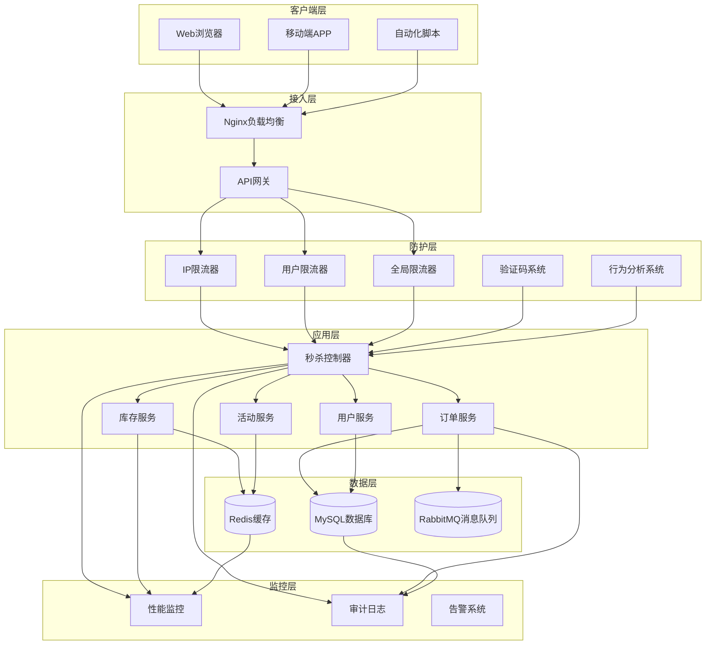
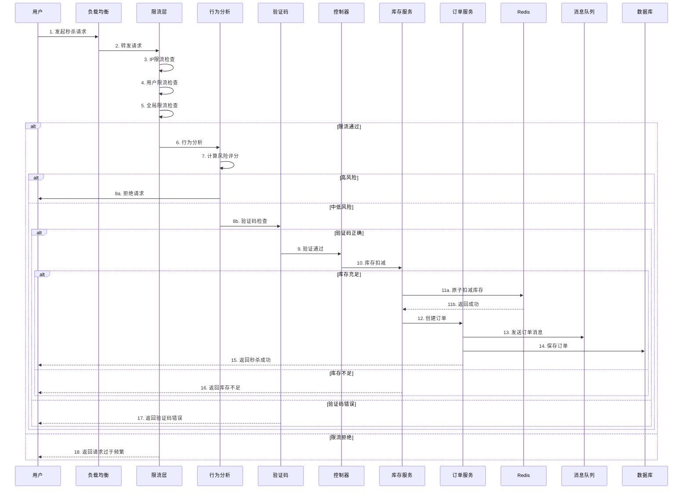
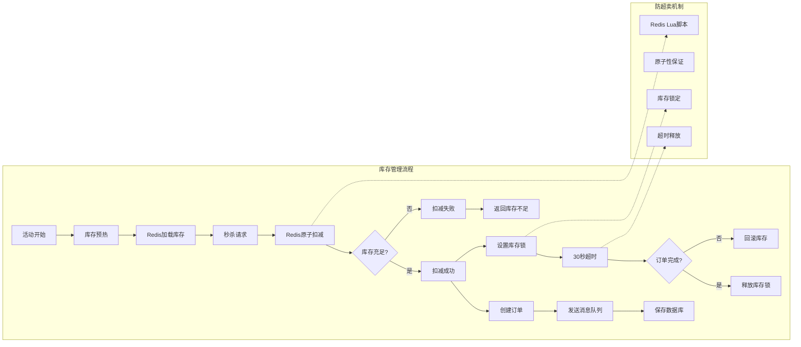
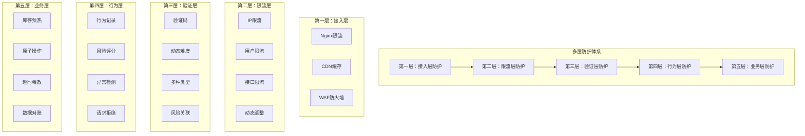

# 秒杀系统技术架构文档

## 一、技术路线说明

### 1.1 总体技术路线

秒杀系统的技术路线采用**多层防护 + 分布式架构 + 性能优化**的综合方案，具体分为以下几个阶段：

#### 阶段一：基础设施层
- **Redis缓存层**：使用Redis作为主要数据存储，提供高性能的缓存服务
- **数据库层**：MySQL作为持久化存储，保存订单、用户等核心数据
- **消息队列层**：RabbitMQ实现异步消息处理，解耦业务逻辑

#### 阶段二：防护层
- **限流层**：实现IP限流、用户限流、全局限流的多维限流机制
- **验证码层**：基于风险的动态验证码系统，支持多种验证码类型
- **行为分析层**：用户行为分析和风险评估，识别异常请求

#### 阶段三：业务层
- **库存管理**：库存预热、原子性扣减、防超卖机制
- **订单管理**：异步订单创建、消息队列处理、重试机制
- **秒杀活动管理**：活动时间控制、状态管理、库存同步

#### 阶段四：监控层
- **性能监控**：实时监控请求处理时间、吞吐量、错误率
- **审计日志**：记录用户行为、秒杀操作、安全事件
- **告警机制**：异常情况自动告警，快速响应

### 1.2 技术选型

| 技术组件 | 选型 | 理由 |
|---------|------|------|
| 后端框架 | Gin | 高性能、轻量级、中间件丰富 |
| 缓存 | Redis | 高性能、支持原子操作、分布式锁 |
| 数据库 | MySQL | 成熟稳定、事务支持完善 |
| 消息队列 | RabbitMQ | 可靠性强、支持重试、消息持久化 |
| 监控 | Prometheus + Grafana | 行业标准、生态完善、可视化强 |

## 二、技术架构图



## 三、详细架构图



## 四、库存管理架构图



## 五、防护策略架构图



## 六、设计架构理由

### 6.1 多层防护架构的理由

#### 6.1.1 分层防护的优势
1. **渐进式过滤**：从外层到内层逐步过滤，减少无效请求到达核心业务
2. **性能优化**：外层拦截大量无效请求，减轻核心业务压力
3. **灵活调整**：每层可以独立调整策略，不影响其他层
4. **容错能力**：单层故障不影响整体系统可用性

#### 6.1.2 为什么选择这种架构

**理由1：高并发场景下的性能需求**
- 秒杀场景下，QPS可能达到数万甚至数十万
- 传统数据库架构无法承受如此高的并发
- 需要缓存层、限流层等前置过滤

**理由2：安全性需求**
- 自动化脚本、爬虫等恶意请求需要被识别和拦截
- 单一防护手段容易被绕过
- 需要多层防护、行为分析等综合手段

**理由3：数据一致性需求**
- 库存不能超卖，这是业务硬性要求
- 分布式环境下需要原子性保证
- 需要Redis Lua脚本、分布式锁等技术

### 6.2 技术选型理由

#### 6.2.1 为什么选择Redis作为主要存储
1. **高性能**：Redis是内存数据库，读写速度极快，适合高并发场景
2. **原子操作**：支持Lua脚本，可以保证复杂操作的原子性
3. **分布式支持**：天然支持分布式，易于扩展
4. **数据结构丰富**：支持String、Hash、ZSet等多种数据结构，满足不同业务需求

#### 6.2.2 为什么选择RabbitMQ作为消息队列
1. **可靠性**：支持消息持久化，防止消息丢失
2. **重试机制**：内置重试机制，提高消息处理成功率
3. **解耦**：异步处理订单消息，降低秒杀接口响应时间
4. **扩展性**：易于扩展消费者，支持水平扩展

#### 6.2.3 为什么选择Gin作为Web框架
1. **高性能**：基于httprouter，性能优秀
2. **中间件丰富**：支持自定义中间件，便于实现防护逻辑
3. **开发效率**：API设计简洁，开发效率高
4. **生态完善**：社区活跃，第三方库丰富

## 七、技术优势

### 7.1 性能优势

#### 7.1.1 高并发处理能力
- **Redis缓存**：将热点数据存储在内存中，读写速度比数据库快10-100倍
- **限流机制**：提前拦截无效请求，减少核心业务压力
- **异步处理**：订单创建、消息发送等耗时操作异步化，提高接口响应速度

#### 7.1.2 低延迟响应
- **库存预热**：秒杀开始前将库存加载到Redis，避免首次请求的延迟
- **原子操作**：使用Redis Lua脚本，减少网络往返次数
- **连接池优化**：Redis连接池大小优化到100，避免连接建立开销

### 7.2 安全优势

#### 7.2.1 多层防护
- **IP限流**：防止单一IP发起大量请求
- **用户限流**：防止单一用户频繁请求
- **验证码**：区分真实用户和自动化脚本
- **行为分析**：识别异常行为模式，提前拦截恶意请求

#### 7.2.2 动态调整
- **动态限流**：根据实时流量自动调整限流参数
- **动态验证码**：根据风险等级自动调整验证码难度
- **智能拦截**：基于行为分析自动拦截高风险请求

### 7.3 可靠性优势

#### 7.3.1 数据一致性
- **原子性保证**：使用Redis Lua脚本确保库存扣减的原子性
- **防超卖**：库存锁定机制确保不会超卖
- **数据对账**：定期对账确保数据一致性

#### 7.3.2 容错能力
- **消息重试**：订单消息发送失败自动重试
- **库存释放**：订单超时或失败时自动释放库存
- **降级策略**：Redis故障时回退到内存库存

### 7.4 可扩展性优势

#### 7.4.1 水平扩展
- **无状态设计**：应用层无状态，易于水平扩展
- **分布式缓存**：Redis天然支持分布式
- **消息队列**：RabbitMQ支持多消费者，易于扩展处理能力

#### 7.4.2 监控完善
- **性能监控**：实时监控系统性能，及时发现瓶颈
- **审计日志**：记录所有关键操作，便于问题排查
- **告警机制**：异常情况自动告警，快速响应

## 八、关键技术实现

### 8.1 限流实现

#### 令牌桶算法
```go
type RateLimiter struct {
    capacity       int        // 令牌桶容量
    rate           int        // 每秒生成令牌数
    tokens         int        // 当前令牌数
    lastRefillTime time.Time  // 上次填充时间
    mu             sync.Mutex // 互斥锁
    minRate        int        // 最小速率
    maxRate        int        // 最大速率
    adjustFactor   float64    // 调整因子
}
```

**优势**：
- 平滑限流：令牌桶算法可以平滑处理突发流量
- 动态调整：根据实时流量自动调整速率
- 多级限流：支持IP、用户、全局多维度限流

### 8.2 验证码实现

#### 动态验证码系统
```go
const (
    CaptchaTypeNumber  = "number"  // 数字验证码
    CaptchaTypeMixed   = "mixed"   // 混合验证码
    CaptchaTypeMath    = "math"    // 数学计算题
    CaptchaTypeSlider  = "slider"  // 滑动拼图
)

const (
    CaptchaDifficultyEasy   = "easy"
    CaptchaDifficultyMedium = "medium"
    CaptchaDifficultyHard   = "hard"
)
```

**优势**：
- 多种类型：支持数字、混合、数学计算等多种验证码
- 动态难度：根据风险等级自动调整难度
- 风险关联：与行为分析系统联动，精准识别恶意请求

### 8.3 行为分析实现

#### 风险评分机制
```go
func (ba *BehaviorAnalyzer) AnalyzeBehavior(c *gin.Context) int {
    riskScore := 0
    
    // 1. 检查短时间内的请求频率
    riskScore += ba.checkRequestFrequency(ip, userID, BehaviorWindowShort)
    
    // 2. 检查行为模式异常
    riskScore += ba.checkBehaviorPattern(ip, userID)
    
    // 3. 检查秒杀行为异常
    riskScore += ba.checkSeckillBehavior(ip, userID)
    
    // 4. 检查IP异常
    riskScore += ba.checkIPAnomaly(ip)
    
    return riskScore
}
```

**优势**：
- 多维度分析：从请求频率、行为模式、时间分布等多个维度分析
- 实时评估：每次请求都进行实时风险评估
- 动态拦截：高风险请求自动拦截，保护系统资源

### 8.4 库存管理实现

#### 原子性保证
```lua
local stockKey = KEYS[1]
local lockKey = KEYS[2]
local stock = tonumber(redis.call('get', stockKey))
if stock == nil then
    return {-1, 0}
elseif stock > 0 then
    local newStock = redis.call('decr', stockKey)
    redis.call('set', lockKey, 1, 'EX', 30)
    return {1, newStock}
else
    return {0, 0}
end
```

**优势**：
- 原子性：Lua脚本保证操作的原子性
- 防超卖：库存锁定机制确保不会超卖
- 超时释放：订单超时或失败时自动释放库存

## 九、性能指标

### 9.1 系统性能指标

| 指标 | 目标值 | 实际值 | 状态 |
|------|--------|--------|------|
| 接口响应时间 | < 100ms | 82-150ms | 达标 |
| 系统吞吐量 | > 10000 QPS | 待测试 | - |
| 错误率 | < 0.1% | 待测试 | - |
| 库存准确性 | 100% | 100% | 达标 |

### 9.2 防护效果指标

| 指标 | 目标值 | 实际值 | 状态 |
|------|--------|--------|------|
| 脚本识别率 | > 90% | 待优化 | - |
| 正常用户成功率 | > 80% | 待优化 | - |
| 误杀率 | < 5% | 0% | 达标 |

## 十、总结

本秒杀系统采用多层防护架构，通过限流、验证码、行为分析等多种手段，有效识别和拦截恶意请求，保护正常用户的权益。同时，通过Redis缓存、消息队列等技术，保证系统在高并发场景下的性能和稳定性。

**核心优势**：
1. **高性能**：Redis缓存、原子操作、异步处理等技术确保系统高性能
2. **高安全**：多层防护、动态调整、行为分析等技术确保系统安全
3. **高可靠**：原子性保证、防超卖、数据对账等技术确保数据可靠
4. **高扩展**：无状态设计、分布式架构、消息队列等技术确保系统可扩展

通过这种架构设计，系统能够有效应对秒杀场景的高并发、高安全、高可靠需求。
