# 秒杀系统设计文档

## 一、系统概述

### 1.1 项目背景
秒杀系统是电商平台的核心功能之一，主要用于处理高并发场景下的限时抢购活动。本系统旨在解决秒杀场景下的高并发、高可用、数据一致性等关键技术挑战。

### 1.2 系统目标
- **高性能**：支持10万+ QPS的并发处理能力
- **高可用**：系统可用性达到99.99%
- **数据一致性**：确保库存准确性，杜绝超卖现象
- **安全防护**：有效识别和拦截自动化脚本攻击
- **用户体验**：正常用户能够公平参与秒杀活动

### 1.3 业务范围
- 秒杀活动管理（创建、启动、停止）
- 库存管理（预热、扣减、恢复）
- 订单管理（创建、查询、取消）
- 用户管理（注册、登录、权限）
- 安全防护（限流、验证码、行为分析）

## 二、系统总体设计

### 2.1 系统架构图

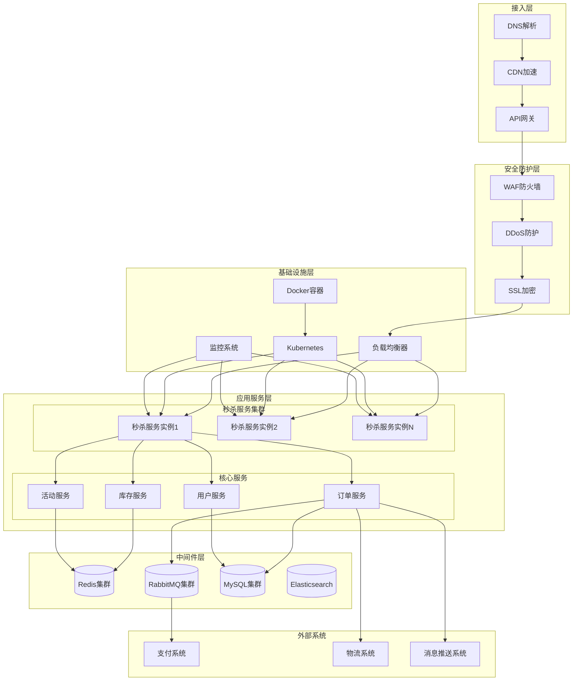

### 2.2 核心业务流程

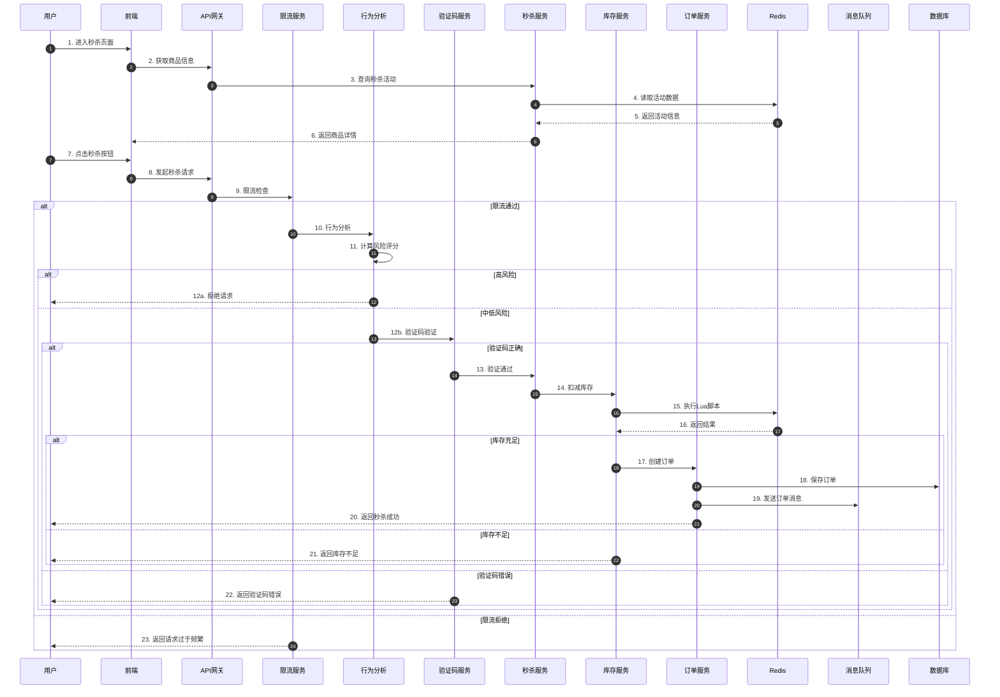

## 三、详细设计

### 3.1 数据库设计

#### 3.1.1 用户表 (users)
```sql
CREATE TABLE users (
    id BIGINT PRIMARY KEY AUTO_INCREMENT COMMENT '用户ID',
    username VARCHAR(50) NOT NULL UNIQUE COMMENT '用户名',
    password VARCHAR(255) NOT NULL COMMENT '密码',
    email VARCHAR(100) UNIQUE COMMENT '邮箱',
    phone VARCHAR(20) UNIQUE COMMENT '手机号',
    status TINYINT DEFAULT 1 COMMENT '状态：0-禁用，1-启用',
    role VARCHAR(20) DEFAULT 'user' COMMENT '角色：admin/user',
    created_at TIMESTAMP DEFAULT CURRENT_TIMESTAMP COMMENT '创建时间',
    updated_at TIMESTAMP DEFAULT CURRENT_TIMESTAMP ON UPDATE CURRENT_TIMESTAMP COMMENT '更新时间',
    INDEX idx_username (username),
    INDEX idx_phone (phone)
) ENGINE=InnoDB DEFAULT CHARSET=utf8mb4 COMMENT='用户表';
```

#### 3.1.2 商品表 (products)
```sql
CREATE TABLE products (
    id BIGINT PRIMARY KEY AUTO_INCREMENT COMMENT '商品ID',
    name VARCHAR(200) NOT NULL COMMENT '商品名称',
    description TEXT COMMENT '商品描述',
    price DECIMAL(10,2) NOT NULL COMMENT '商品价格',
    stock INT NOT NULL DEFAULT 0 COMMENT '库存数量',
    status TINYINT DEFAULT 1 COMMENT '状态：0-下架，1-上架',
    created_at TIMESTAMP DEFAULT CURRENT_TIMESTAMP COMMENT '创建时间',
    updated_at TIMESTAMP DEFAULT CURRENT_TIMESTAMP ON UPDATE CURRENT_TIMESTAMP COMMENT '更新时间',
    INDEX idx_status (status),
    INDEX idx_created_at (created_at)
) ENGINE=InnoDB DEFAULT CHARSET=utf8mb4 COMMENT='商品表';
```

#### 3.1.3 秒杀活动表 (seckill_events)
```sql
CREATE TABLE seckill_events (
    id BIGINT PRIMARY KEY AUTO_INCREMENT COMMENT '活动ID',
    product_id BIGINT NOT NULL COMMENT '商品ID',
    seckill_price DECIMAL(10,2) NOT NULL COMMENT '秒杀价格',
    stock INT NOT NULL COMMENT '秒杀库存',
    start_time TIMESTAMP NOT NULL COMMENT '开始时间',
    end_time TIMESTAMP NOT NULL COMMENT '结束时间',
    status TINYINT DEFAULT 0 COMMENT '状态：0-未开始，1-进行中，2-已结束',
    created_at TIMESTAMP DEFAULT CURRENT_TIMESTAMP COMMENT '创建时间',
    updated_at TIMESTAMP DEFAULT CURRENT_TIMESTAMP ON UPDATE CURRENT_TIMESTAMP COMMENT '更新时间',
    INDEX idx_product_id (product_id),
    INDEX idx_status (status),
    INDEX idx_start_time (start_time),
    INDEX idx_end_time (end_time),
    FOREIGN KEY (product_id) REFERENCES products(id)
) ENGINE=InnoDB DEFAULT CHARSET=utf8mb4 COMMENT='秒杀活动表';
```

#### 3.1.4 订单表 (orders)
```sql
CREATE TABLE orders (
    id BIGINT PRIMARY KEY AUTO_INCREMENT COMMENT '订单ID',
    order_no VARCHAR(50) NOT NULL UNIQUE COMMENT '订单编号',
    user_id BIGINT NOT NULL COMMENT '用户ID',
    product_id BIGINT NOT NULL COMMENT '商品ID',
    event_id BIGINT NOT NULL COMMENT '活动ID',
    quantity INT NOT NULL DEFAULT 1 COMMENT '购买数量',
    total_amount DECIMAL(10,2) NOT NULL COMMENT '订单总金额',
    status TINYINT DEFAULT 0 COMMENT '状态：0-待支付，1-已支付，2-已取消，3-已退款',
    pay_time TIMESTAMP NULL COMMENT '支付时间',
    created_at TIMESTAMP DEFAULT CURRENT_TIMESTAMP COMMENT '创建时间',
    updated_at TIMESTAMP DEFAULT CURRENT_TIMESTAMP ON UPDATE CURRENT_TIMESTAMP COMMENT '更新时间',
    INDEX idx_user_id (user_id),
    INDEX idx_product_id (product_id),
    INDEX idx_event_id (event_id),
    INDEX idx_status (status),
    INDEX idx_order_no (order_no),
    INDEX idx_created_at (created_at),
    FOREIGN KEY (user_id) REFERENCES users(id),
    FOREIGN KEY (product_id) REFERENCES products(id),
    FOREIGN KEY (event_id) REFERENCES seckill_events(id)
) ENGINE=InnoDB DEFAULT CHARSET=utf8mb4 COMMENT='订单表';
```

#### 3.1.5 库存流水表 (stock_logs)
```sql
CREATE TABLE stock_logs (
    id BIGINT PRIMARY KEY AUTO_INCREMENT COMMENT '流水ID',
    product_id BIGINT NOT NULL COMMENT '商品ID',
    event_id BIGINT NOT NULL COMMENT '活动ID',
    user_id BIGINT NOT NULL COMMENT '用户ID',
    type TINYINT NOT NULL COMMENT '类型：1-扣减，2-恢复',
    quantity INT NOT NULL COMMENT '数量',
    before_stock INT NOT NULL COMMENT '操作前库存',
    after_stock INT NOT NULL COMMENT '操作后库存',
    created_at TIMESTAMP DEFAULT CURRENT_TIMESTAMP COMMENT '创建时间',
    INDEX idx_product_id (product_id),
    INDEX idx_event_id (event_id),
    INDEX idx_user_id (user_id),
    INDEX idx_created_at (created_at),
    FOREIGN KEY (product_id) REFERENCES products(id),
    FOREIGN KEY (event_id) REFERENCES seckill_events(id),
    FOREIGN KEY (user_id) REFERENCES users(id)
) ENGINE=InnoDB DEFAULT CHARSET=utf8mb4 COMMENT='库存流水表';
```

### 3.2 接口设计

#### 3.2.1 用户模块

**用户注册**
```
POST /api/user/register
Request:
{
    "username": "string",
    "password": "string",
    "email": "string",
    "phone": "string"
}
Response:
{
    "code": 0,
    "message": "success",
    "data": {
        "userId": 123456,
        "username": "test_user"
    }
}
```

**用户登录**
```
POST /api/user/login
Request:
{
    "username": "string",
    "password": "string"
}
Response:
{
    "code": 0,
    "message": "success",
    "data": {
        "token": "eyJhbGciOiJIUzI1NiIs...",
        "userId": 123456,
        "username": "test_user"
    }
}
```

#### 3.2.2 商品模块

**获取商品列表**
```
GET /api/product/list?page=1&size=20
Response:
{
    "code": 0,
    "message": "success",
    "data": {
        "total": 100,
        "list": [
            {
                "id": 1,
                "name": "iPhone 15 Pro",
                "description": "最新款苹果手机",
                "price": 7999.00,
                "stock": 100,
                "status": 1
            }
        ]
    }
}
```

**获取商品详情**
```
GET /api/product/get/{id}
Response:
{
    "code": 0,
    "message": "success",
    "data": {
        "id": 1,
        "name": "iPhone 15 Pro",
        "description": "最新款苹果手机",
        "price": 7999.00,
        "stock": 100,
        "status": 1,
        "seckillEvent": {
            "id": 1,
            "seckillPrice": 6999.00,
            "stock": 10,
            "startTime": "2024-01-01 20:00:00",
            "endTime": "2024-01-01 21:00:00",
            "status": 1
        }
    }
}
```

#### 3.2.3 秒杀模块

**获取验证码**
```
GET /api/captcha?risk=low
Response:
图片数据
Headers:
X-Captcha-ID: 1234567890
X-Captcha-Type: number
X-Captcha-Difficulty: easy
```

**执行秒杀**
```
POST /api/product/seckill
Headers:
Authorization: Bearer {token}
Request:
{
    "productId": 1,
    "captchaId": "1234567890",
    "captchaStr": "1234"
}
Response:
{
    "code": 0,
    "message": "秒杀成功",
    "data": {
        "orderId": 123456,
        "orderNo": "SK20240101123456",
        "productId": 1,
        "quantity": 1,
        "totalAmount": 6999.00,
        "status": 0,
        "createdAt": "2024-01-01 20:00:01"
    }
}
```

**错误响应示例**
```
{
    "code": 400,
    "message": "库存不足",
    "data": null
}
```

#### 3.2.4 订单模块

**获取订单列表**
```
GET /api/order/list?page=1&size=20&status=0
Headers:
Authorization: Bearer {token}
Response:
{
    "code": 0,
    "message": "success",
    "data": {
        "total": 10,
        "list": [
            {
                "id": 123456,
                "orderNo": "SK20240101123456",
                "productId": 1,
                "productName": "iPhone 15 Pro",
                "quantity": 1,
                "totalAmount": 6999.00,
                "status": 0,
                "createdAt": "2024-01-01 20:00:01"
            }
        ]
    }
}
```

**取消订单**
```
POST /api/order/cancel/{id}
Headers:
Authorization: Bearer {token}
Response:
{
    "code": 0,
    "message": "取消成功",
    "data": {
        "orderId": 123456,
        "status": 2
    }
}
```

### 3.3 核心算法设计

#### 3.3.1 令牌桶限流算法

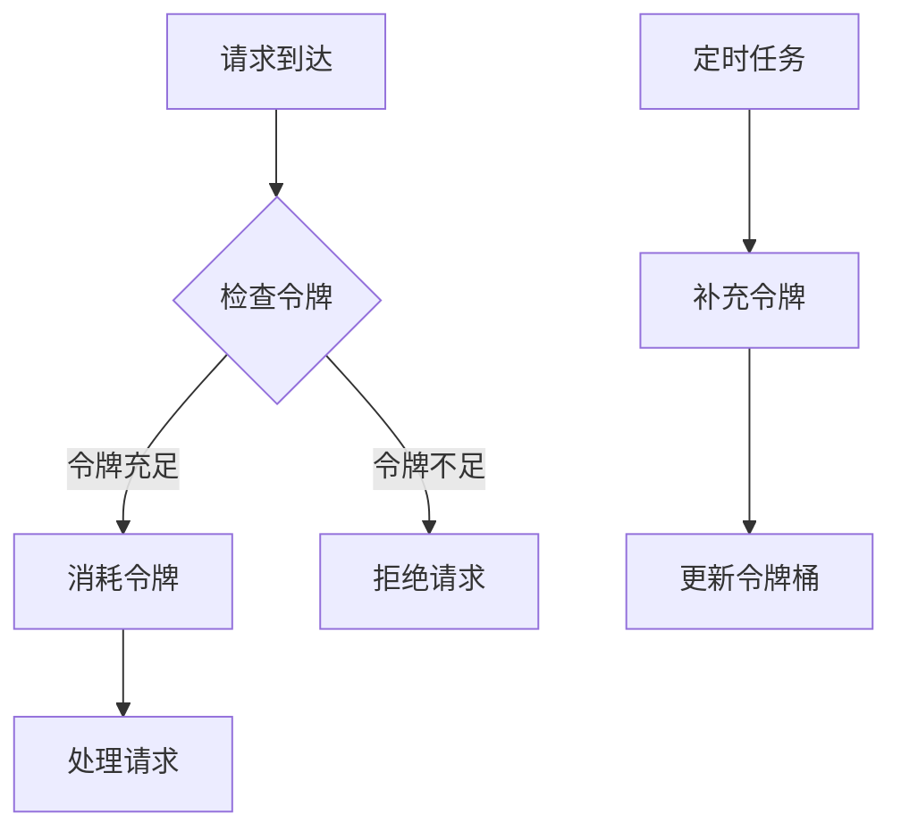

**算法实现**
```go
type TokenBucket struct {
    capacity     int           // 桶容量
    tokens       float64       // 当前令牌数
    rate         float64       // 令牌生成速率（个/秒）
    lastUpdate   time.Time     // 上次更新时间
    mu           sync.Mutex    // 互斥锁
}

func (tb *TokenBucket) Allow() bool {
    tb.mu.Lock()
    defer tb.mu.Unlock()
    
    // 计算需要补充的令牌
    now := time.Now()
    elapsed := now.Sub(tb.lastUpdate).Seconds()
    tb.tokens = math.Min(tb.capacity, tb.tokens+elapsed*tb.rate)
    tb.lastUpdate = now
    
    // 检查是否有足够的令牌
    if tb.tokens >= 1 {
        tb.tokens--
        return true
    }
    return false
}
```

#### 3.3.2 库存扣减算法

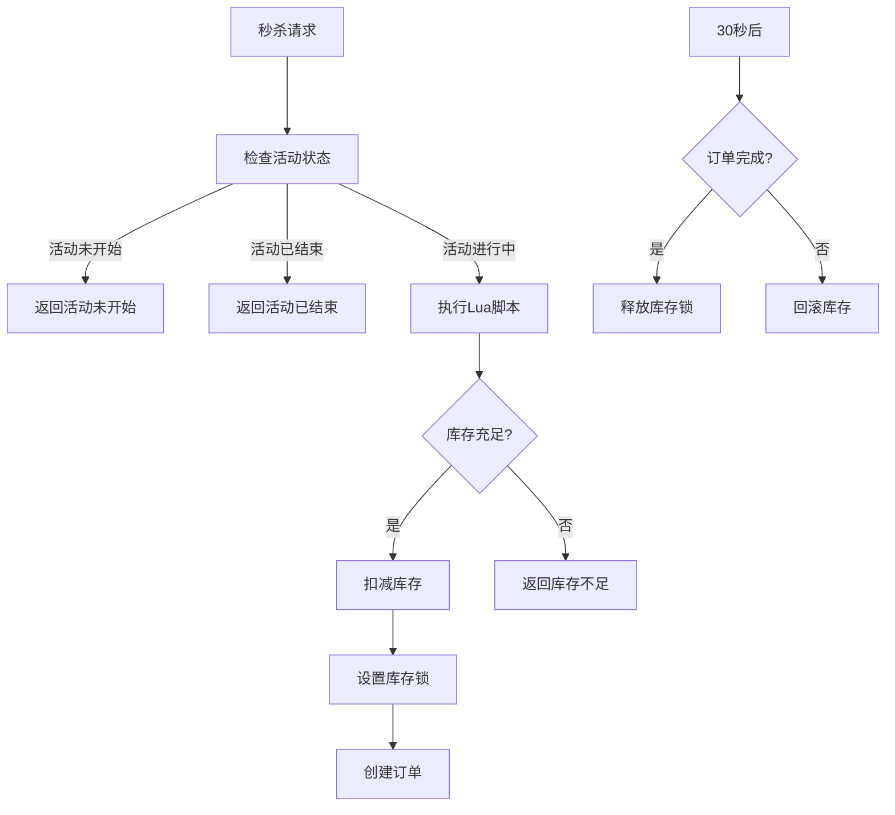

**Lua脚本实现**
```lua
-- 库存扣减脚本
local stockKey = KEYS[1]
local lockKey = KEYS[2]
local userKey = KEYS[3]
local userId = ARGV[1]

-- 检查用户是否已购买
local hasBought = redis.call('sismember', userKey, userId)
if hasBought == 1 then
    return {-2, 0}  -- 已购买
end

-- 检查库存
local stock = tonumber(redis.call('get', stockKey))
if stock == nil then
    return {-1, 0}  -- 库存不存在
elseif stock <= 0 then
    return {0, 0}   -- 库存不足
end

-- 扣减库存
local newStock = redis.call('decr', stockKey)
-- 设置库存锁（30秒过期）
redis.call('set', lockKey, userId, 'EX', 30)
-- 记录用户已购买
redis.call('sadd', userKey, userId)

return {1, newStock}  -- 扣减成功
```

#### 3.3.3 行为分析算法

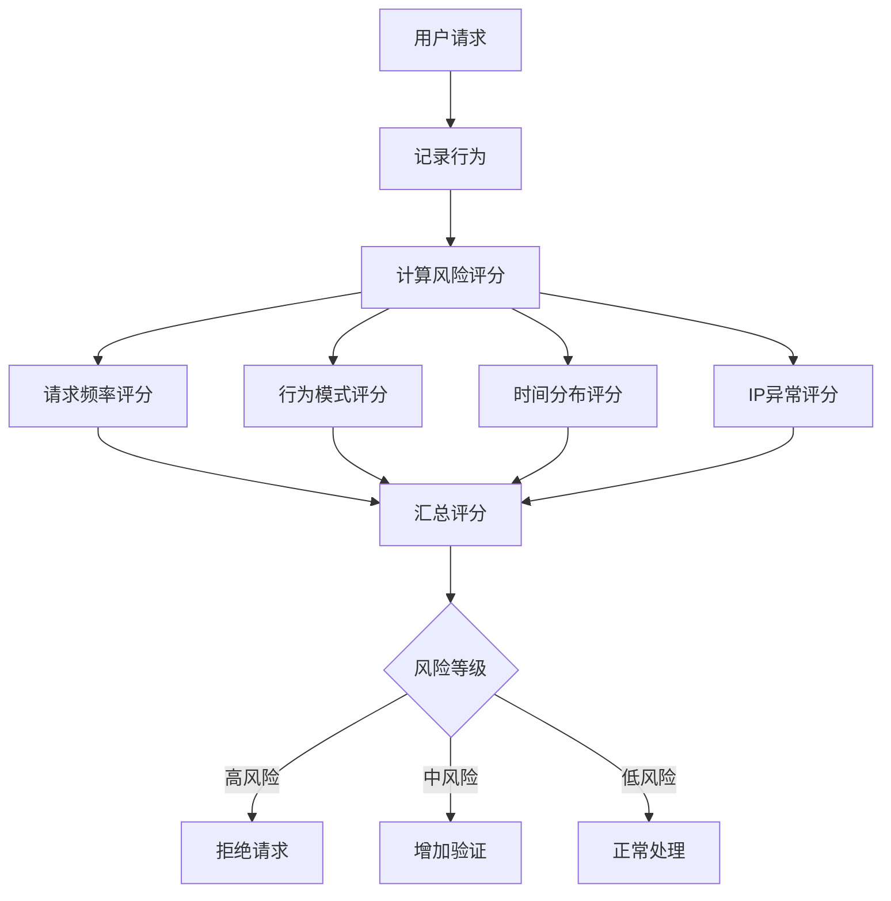

**风险评分计算**
```go
func CalculateRiskScore(userBehavior UserBehavior) int {
    score := 0
    
    // 1. 请求频率评分（0-30分）
    requestCount := getRequestCount(userBehavior.IP, time.Minute)
    if requestCount > 100 {
        score += 30
    } else if requestCount > 50 {
        score += 20
    } else if requestCount > 20 {
        score += 10
    }
    
    // 2. 行为模式评分（0-30分）
    if userBehavior.PageViews == 0 && userBehavior.SeckillAttempts > 0 {
        score += 30  // 直接秒杀，没有浏览页面
    } else if userBehavior.PageViews < userBehavior.SeckillAttempts {
        score += 15  // 浏览页面次数少于秒杀次数
    }
    
    // 3. 时间分布评分（0-25分）
    intervals := getRequestIntervals(userBehavior.IP)
    if isRegularPattern(intervals) {
        score += 25  // 请求时间过于规律，可能是脚本
    }
    
    // 4. IP异常评分（0-15分）
    if isProxyIP(userBehavior.IP) {
        score += 15
    } else if isAbnormalLocation(userBehavior.IP) {
        score += 10
    }
    
    return score
}
```

## 四、非功能性设计

### 4.1 性能设计

#### 4.1.1 缓存策略

**多级缓存架构**
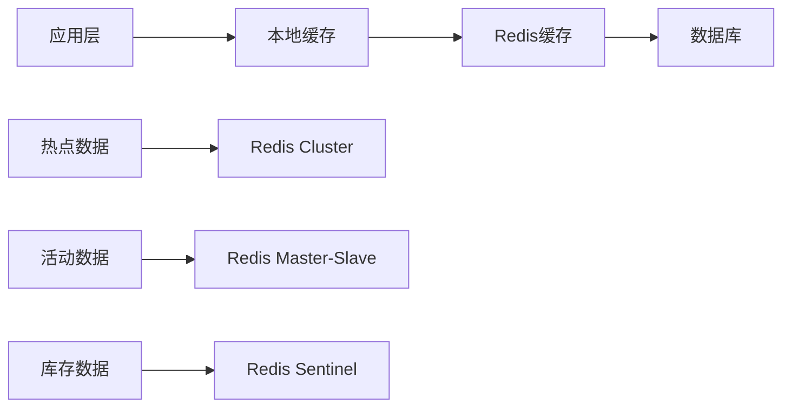

**缓存更新策略**
- **读策略**：先读本地缓存，再读Redis，最后读数据库
- **写策略**：先写数据库，再删缓存，使用延迟双删防止脏读
- **预热策略**：秒杀活动开始前，将库存数据预热到Redis

#### 4.1.2 数据库优化

**读写分离**
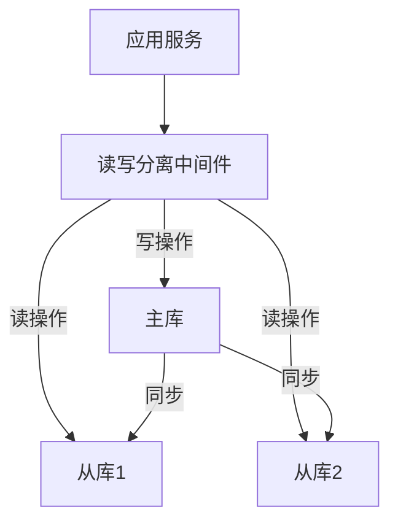

**分库分表策略**
- **用户表**：按用户ID哈希分表
- **订单表**：按时间范围分表（按月）
- **库存流水表**：按商品ID哈希分表

### 4.2 安全设计

#### 4.2.1 安全防护体系

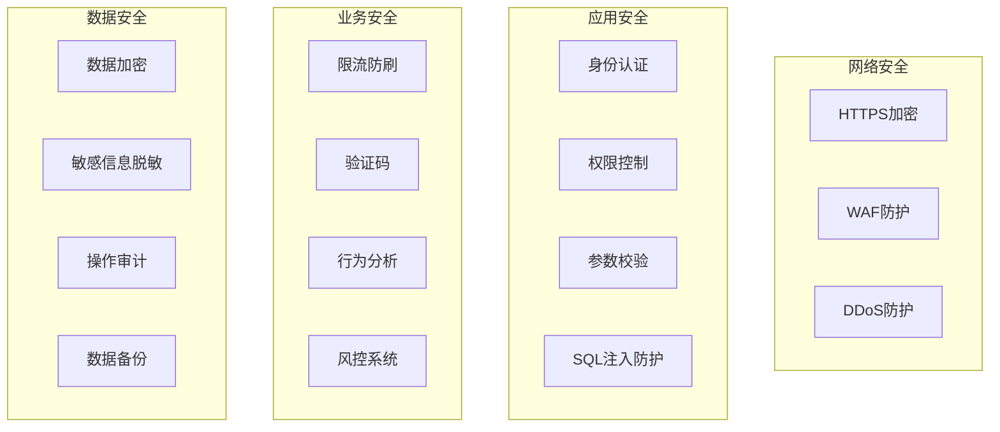

#### 4.2.2 限流策略

**多级限流**
| 限流级别 | 限流对象 | 限流规则 | 触发动作 |
|---------|---------|---------|---------|
| 接入层限流 | IP | 100次/分钟 | 返回429错误 |
| 应用层限流 | 用户 | 10次/分钟 | 返回请求频繁 |
| 接口层限流 | 接口 | 1000次/分钟 | 返回服务繁忙 |
| 库存层限流 | 商品 | 库存数量 | 返回库存不足 |

### 4.3 高可用设计

#### 4.3.1 服务高可用

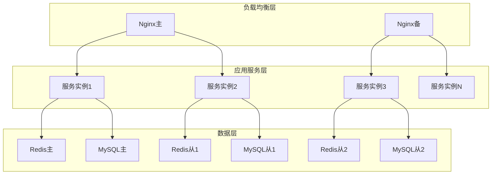

#### 4.3.2 故障转移

**Redis故障转移**
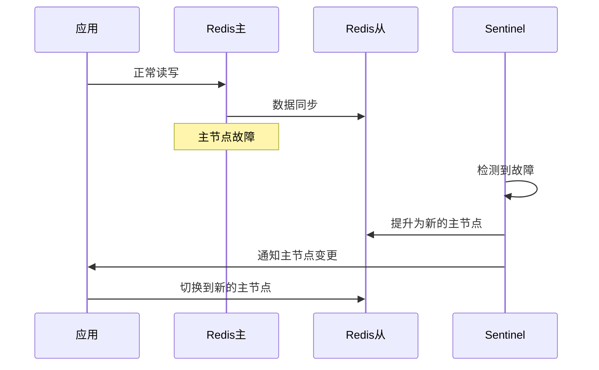

### 4.4 监控设计

#### 4.4.1 监控体系

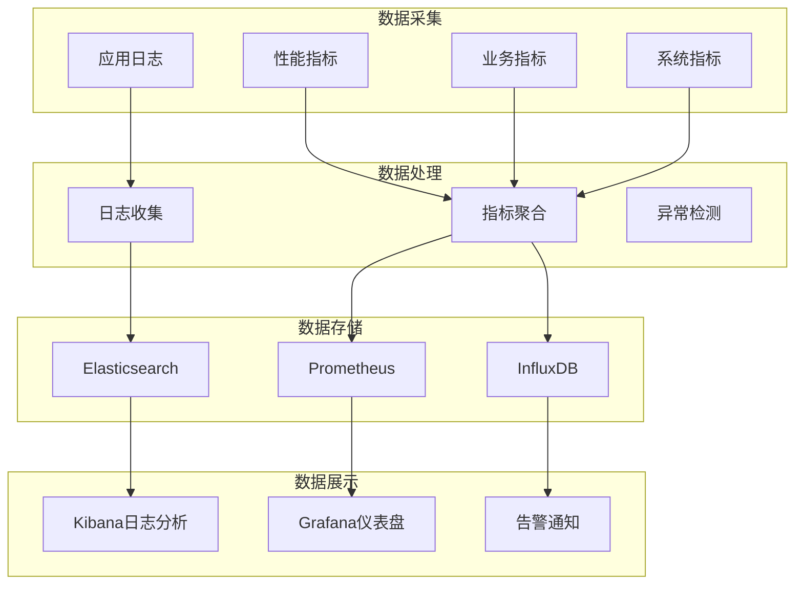

#### 4.4.2 关键监控指标

| 指标类型 | 指标名称 | 告警阈值 | 告警级别 |
|---------|---------|---------|---------|
| 性能指标 | 接口响应时间 | > 500ms | 警告 |
| 性能指标 | 错误率 | > 1% | 严重 |
| 业务指标 | 秒杀成功率 | < 50% | 警告 |
| 业务指标 | 库存异常 | > 0 | 严重 |
| 系统指标 | CPU使用率 | > 80% | 警告 |
| 系统指标 | 内存使用率 | > 85% | 严重 |
| 系统指标 | 磁盘使用率 | > 90% | 严重 |

## 五、部署架构

### 5.1 生产环境部署

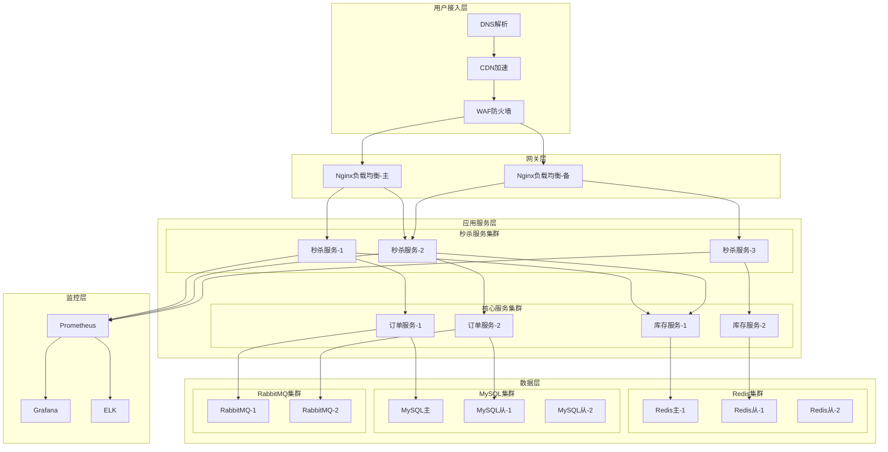

### 5.2 容器化部署

**Docker Compose配置**
```yaml
version: '3.8'
services:
  # 秒杀服务
  seckill-service:
    image: seckill-service:latest
    ports:
      - "8081:8081"
    environment:
      - REDIS_HOST=redis
      - DB_HOST=mysql
      - MQ_HOST=rabbitmq
    depends_on:
      - redis
      - mysql
      - rabbitmq
    deploy:
      replicas: 3
      resources:
        limits:
          cpus: '2'
          memory: 2G
    networks:
      - seckill-network

  # Redis
  redis:
    image: redis:7-alpine
    ports:
      - "6379:6379"
    volumes:
      - redis-data:/data
    command: redis-server --appendonly yes --maxmemory 2gb --maxmemory-policy allkeys-lru
    networks:
      - seckill-network

  # MySQL
  mysql:
    image: mysql:8.0
    ports:
      - "3306:3306"
    environment:
      - MYSQL_ROOT_PASSWORD=root123
      - MYSQL_DATABASE=seckill
    volumes:
      - mysql-data:/var/lib/mysql
      - ./init.sql:/docker-entrypoint-initdb.d/init.sql
    networks:
      - seckill-network

  # RabbitMQ
  rabbitmq:
    image: rabbitmq:3-management
    ports:
      - "5672:5672"
      - "15672:15672"
    environment:
      - RABBITMQ_DEFAULT_USER=admin
      - RABBITMQ_DEFAULT_PASS=admin123
    volumes:
      - rabbitmq-data:/var/lib/rabbitmq
    networks:
      - seckill-network

  # Nginx
  nginx:
    image: nginx:alpine
    ports:
      - "80:80"
      - "443:443"
    volumes:
      - ./nginx.conf:/etc/nginx/nginx.conf
      - ./ssl:/etc/nginx/ssl
    depends_on:
      - seckill-service
    networks:
      - seckill-network

volumes:
  redis-data:
  mysql-data:
  rabbitmq-data:

networks:
  seckill-network:
    driver: bridge
```

## 六、测试方案

### 6.1 测试策略

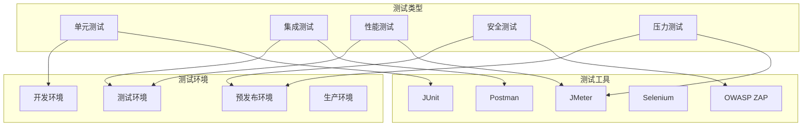

### 6.2 性能测试方案

**测试场景**
| 场景 | 并发用户数 | 持续时间 | 目标TPS | 目标响应时间 |
|-----|-----------|---------|---------|-------------|
| 正常秒杀 | 1000 | 10分钟 | 5000 | < 100ms |
| 高并发秒杀 | 10000 | 10分钟 | 10000 | < 200ms |
| 极限压力测试 | 50000 | 5分钟 | 20000 | < 500ms |

**测试指标**
- 吞吐量（TPS）
- 响应时间（P50、P95、P99）
- 错误率
- CPU使用率
- 内存使用率
- 网络IO
- 数据库连接数

## 七、运维方案

### 7.1 日常运维

**监控检查清单**
- [ ] 检查系统资源使用情况（CPU、内存、磁盘）
- [ ] 检查应用日志，关注错误和异常
- [ ] 检查数据库连接数和慢查询
- [ ] 检查Redis内存使用情况和命中率
- [ ] 检查消息队列积压情况
- [ ] 检查秒杀活动状态和库存情况

**定期维护任务**
| 任务 | 频率 | 负责人 | 备注 |
|-----|------|--------|------|
| 数据库备份 | 每日 | DBA | 全量备份 |
| 日志清理 | 每周 | 运维 | 保留30天 |
| 性能分析 | 每周 | 开发 | 慢查询优化 |
| 安全扫描 | 每月 | 安全 | 漏洞扫描 |
| 容量规划 | 每季度 | 架构 | 资源评估 |

### 7.2 应急响应

**应急响应流程**
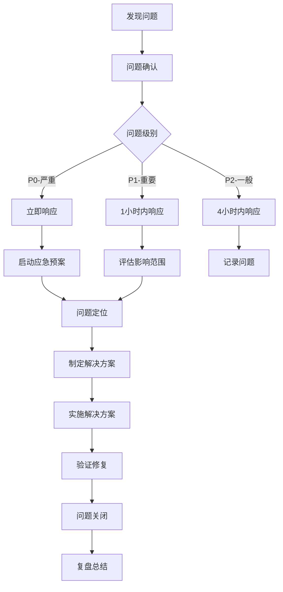

**应急预案**
| 场景 | 应急措施 | 恢复时间目标 |
|-----|---------|-------------|
| Redis故障 | 切换到备节点 | < 1分钟 |
| 数据库故障 | 切换到从库 | < 5分钟 |
| 服务宕机 | 重启服务/切换到备用实例 | < 3分钟 |
| 网络故障 | 切换到备用线路 | < 2分钟 |
| DDoS攻击 | 启用DDoS防护 | < 5分钟 |

## 八、项目计划

### 8.1 开发计划

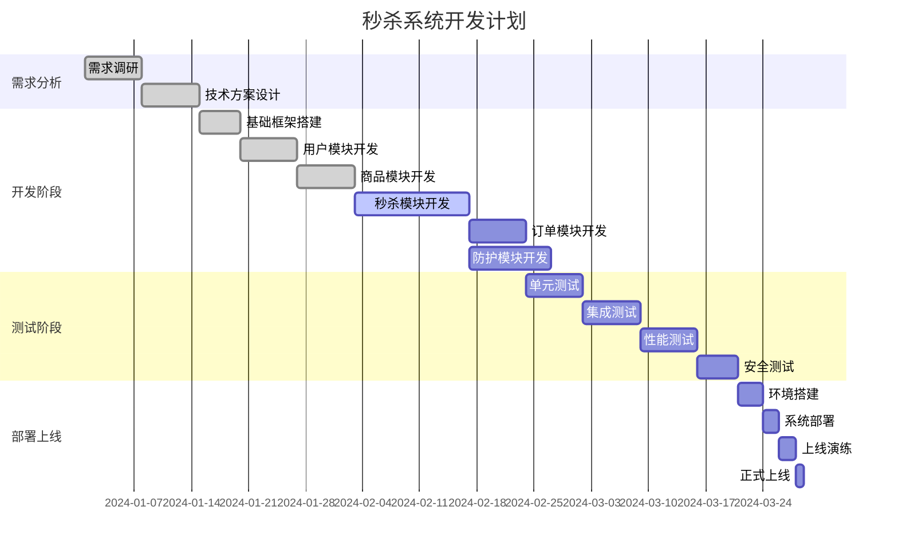

### 8.2 里程碑

| 里程碑 | 计划日期 | 交付物 | 验收标准 |
|--------|---------|--------|---------|
| 需求评审完成 | 2024-01-15 | 需求文档 | 需求评审通过 |
| 技术方案评审 | 2024-01-22 | 技术方案 | 方案评审通过 |
| 核心功能开发 | 2024-02-15 | 代码 | 功能测试通过 |
| 系统测试完成 | 2024-03-01 | 测试报告 | 测试用例通过率>95% |
| 上线发布 | 2024-03-08 | 上线版本 | 生产环境稳定运行 |

## 九、风险评估

### 9.1 技术风险

| 风险 | 可能性 | 影响程度 | 应对措施 |
|-----|--------|---------|---------|
| Redis性能瓶颈 | 中 | 高 | 集群化部署、读写分离 |
| 数据库连接池耗尽 | 中 | 高 | 连接池优化、限流保护 |
| 库存超卖 | 低 | 极高 | Lua脚本原子操作、库存锁定 |
| 消息队列积压 | 中 | 中 | 增加消费者、消息TTL |
| 服务雪崩 | 低 | 高 | 熔断降级、限流保护 |

### 9.2 业务风险

| 风险 | 可能性 | 影响程度 | 应对措施 |
|-----|--------|---------|---------|
| 秒杀活动被刷单 | 高 | 高 | 多层防护、行为分析 |
| 用户体验差 | 中 | 中 | 性能优化、前端优化 |
| 库存不准确 | 低 | 极高 | 数据对账、库存锁定 |
| 系统不可用 | 低 | 极高 | 高可用架构、故障转移 |

## 十、总结

本系统设计文档详细描述了秒杀系统的整体架构、核心功能、技术选型、部署方案等内容。通过多层防护架构、高性能缓存、原子性操作等技术手段，确保系统在高并发场景下的稳定性、安全性和数据一致性。

**核心设计亮点**：
1. **多层防护体系**：从接入层到业务层的五层防护，有效识别和拦截恶意请求
2. **高性能架构**：Redis缓存、异步处理、连接池优化等技术确保系统高性能
3. **数据一致性**：Lua脚本原子操作、库存锁定、数据对账确保数据准确
4. **高可用设计**：集群部署、故障转移、熔断降级确保系统高可用
5. **可扩展架构**：无状态设计、微服务架构、容器化部署确保系统可扩展

通过本系统的实施，能够有效支撑大规模秒杀活动，保障正常用户的公平参与，同时防止自动化脚本的恶意攻击。
